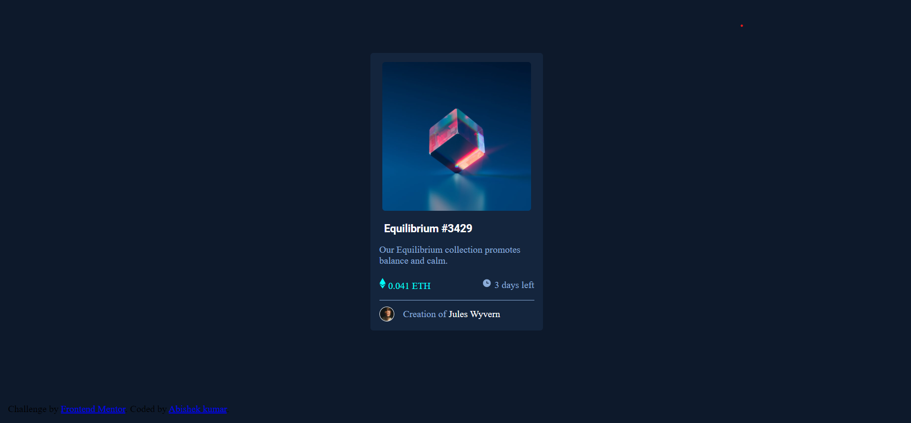

# Frontend Mentor - NFT preview card component solution

This is a solution to the [NFT preview card component challenge on Frontend Mentor](https://www.frontendmentor.io/challenges/nft-preview-card-component-SbdUL_w0U). Frontend Mentor challenges help you improve your coding skills by building realistic projects.

## Table of contents

- [Overview](#overview)
  - [Screenshot](#screenshot)
  - [Links](#links)
- [My process](#my-process)
  - [Built with](#built-with)
  - [What I learned](#what-i-learned)
  - [Continued development](#continued-development)
- [Author](#author)

## Overview

This is to create a preview card of for ethirium on of the most popular block chains.
It is to be create using HTML and CSS only.

### Screenshot

the screenshot is named "screenShort" it is a png format image.
it is only the desktop preview.

### Links

- Solution URL: [github link for the solution](https://your-solution-url.com)
- Live Site URL: [github website link](https://your-live-site-url.com)

1. please note that github website is a free website.
2. This site may or may not be visible in future. That depends on github policies.
3. On the date of submission of the solution it is visible. Data 05-feb-2022

## My process

1. I roughly made a markup on a page.
2. created the html element.
3. styled individual element.
4. checked them on live server compared them desktop preview and adjusted them.

### Built with

- Semantic HTML5 markup
- CSS custom properties
- Flexbox
- flexbox is used in amountAndDay element and creatorSection because it is best way to align element without over complicating code.

### Continued development

I would like to add hover and click animation to page in future to make it more engaging using css and javascript.

## Author

- Frontend Mentor - [@Thisislearner](https://www.frontendmentor.io/profile/Thisislearner)
- Twitter - [@abhi92039385](https://twitter.com/abhi92039385)
